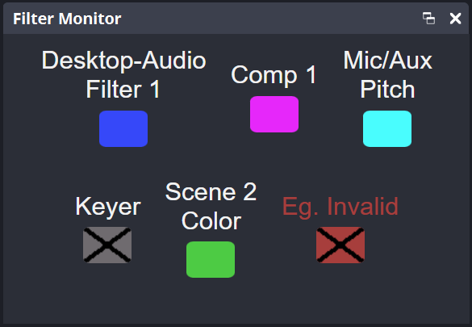

# OBS Filter Monitor

This tool allows you to monitor and toggle the enabled state of one or multiple source filters within your OBS environment.  
The Filter Monitor can be run inside OBS custom browser docks or any modern web browser.

## Index
- [Requirements](#requirements)
- [Where to Start?](#where-to-start)
- [Ways to Configure FilterMonitor](#ways-to-set-up-filtermonitor)
	- [Dynamic Configuration Script](docs/python-config.md)
	- [Manual Configuration](docs/manual-config.md)
- [Set up Inside OBS](docs/set-up-inside-obs.md#set-up-inside-obs)
	- [Enabling OBS WebSocket Server](docs/set-up-inside-obs.md#enabling-obs-websocket-server)
	- [Adding the FilterMonitor Dock](docs/set-up-inside-obs.md#adding-the-filtermonitor-dock)
- [Customizing FilterMonitor](docs/customize-and-advanced.md#customizing-filtermonitor)
	- [Modifying Visuals](docs/customize-and-advanced.md#modifying-visuals)
	- [Creating Custom Overlay Symbols](docs/customize-and-advanced.md#creating-custom-overlay-symbols)
- [Advanced Usage](docs/customize-and-advanced.md#docs/customize-and-advanced.md)
	- [Monitoring from Another Device](docs/customize-and-advanced.md#monitoring-from-another-device)
	- [Using the Tool Without an Internet Connection](docs/customize-and-advanced.md#using-the-tool-without-an-internet-connection)
- [Help](#help)

### Requirements
- OBS 30 and up

### Where to start?

To set up OBS Filter Monitor for yourself, you'll need to:
1) Get the project files
2) Choose how you'll configure the monitor
3) Follow the appropriate setup process of your choosing

### Getting the Project Files
To get the repository files, **either:**
- [Download this repository](https://github.com/lebaston100/obsFilterMonitor/archive/master.zip) and unpack the zip file.
- Use git to clone the repo.
- Download the specific files you need as you go.

### Ways to Set up FilterMonitor
To set up and use FilterMonitor, you can **either:**

- [Use the configuration manager Python script](docs/python-config.md) (easier to add, remove, reorder and modify filters later)

- [Manually configure the monitor](docs/manual-config.md) (Faster startup times; Less potential points of failure)

### Help

You have trouble setting it up or found a bug, then join my [Discord Server](https://discord.gg/PCYQJwX)

Thanks to [Strike](https://www.twitch.tv/strike) for the idea for this.  
Thanks to [theCYBRIX](https://github.com/theCYBRIX) for adding the configuration script.
